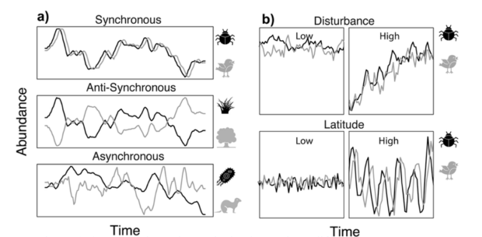

This repository serves as the home base for the NEON-SYNC working group! It contains information about the project and members, alongside the code used in the project.

[Edit this homepage in GitHub](https://github.com/CU-ESIIL/Working_group_OASIS/edit/main/docs/index.md){ .md-button .md-button--secondary }
[Open the GitHub repository](https://github.com/CU-ESIIL/Working_group_OASIS){ .md-button }

## Project Abstract

Populations of different taxa often rise and fall together through time—a pattern called temporal synchrony—but sometimes they move in opposite directions or not at all. These rhythms can either steady ecosystems or make them more vulnerable to sudden change. Using NEON, a monitoring network which tracks many kinds of organisms across U.S. ecosystems, we will measure how strongly pairs of groups (for example, insects and the birds that eat them) move together, and how those patterns depend on species’ traits (like how fast they reproduce or what they eat) and local conditions (climate extremes, productivity, and disturbance such as fire or floods). We will generate tools that provide early warning and practical guidance for conservation—helping managers prioritize vulnerable food-web links and focus monitoring where coordinated declines are most likely under global change.

## Working Group Landmarks

Use these lightweight labels to connect work sessions, meeting notes, and homepage edits:

WG-A People and roles; WG-B Question and scope; WG-C Data and access; WG-D Methods and workflows; WG-E Results and synthesis; WG-F Outputs and handoff.

[Use the landmark guide](instructions/working-group-landmarks.md){ .md-button .md-button--secondary }

## How This Repo Is Organized

The repository has two connected layers. Top-level files configure the project and its automation. The `docs/` folder contains the website content. `mkdocs.yml` tells MkDocs how to turn that content into the public site. Analysis folders hold the working scientific materials that generate the results shown on the website.

| Part of the repo | What it does | What usually belongs there |
| --- | --- | --- |
| Top-level files and folders | Configure the project and keep shared repository guidance in one place | `README.md`, `LICENSE`, workflows, containers, templates, environment setup, and repo-wide metadata |
| `docs/` | Stores the source content for the public website | Homepage text, summaries, methods, community-facing documentation, and website assets |
| `mkdocs.yml` | Controls how the site is rendered | Navigation, theme settings, plugins, and GitHub edit links |
| Working folders | Hold the science-in-progress | Data references, notebooks, scripts, workflows, figures, outputs, and reproducibility materials |

## Repository Side: Do the Science

![Placeholder image for the repository side of the workflow][slot-repository-side]{ .slot-button-image }

--8<-- "_generated/slot_notes/repository-side.md"

Related landmarks: WG-C Data and access; WG-D Methods and workflows.

The repository is the working record of the group: it tracks what changed, why it changed, and how results were produced.

- Data sources and metadata
- Notebooks and scripts
- Workflows and reproducible analysis
- Meeting notes and decisions
- Figures, tables, and other outputs

## Website Side: Share the Science

![Placeholder image for the website side of the workflow][slot-website-side]{ .slot-button-image }

--8<-- "_generated/slot_notes/website-side.md"

Related landmarks: WG-E Results and synthesis; WG-F Outputs and handoff.

The website turns the working group record into a readable public report.

- Plain-language summaries
- Methods documentation
- Figures, maps, and visualizations
- Meeting outputs and synthesis products
- Manuscripts, reports, or educational materials

## How the Two Sides Connect

The repository and website are not separate products. When the group updates data, analysis code, figures, or written summaries in GitHub, those changes can be rendered through the website. Commits are the bridge between doing the science and sharing the science.

## When This Working Group Is Live

A working group is live when:

- The research question is stated
- Data sources are linked or documented
- At least one analysis or workflow is runnable
- Outputs are committed to the repository
- The website explains what the group is doing and why it matters

For guidance on turning this scaffold into a public scientific record, see the [Public-Facing Site Guide](public-facing-site-guide.md).

## Early Process Gallery

Use this section to show how the working group gets started without manually editing image links one by one.

--8<-- "_generated/galleries/root/start-here/index.md"

## Key Links to Replace

Use this section for the links your group will actually maintain. Replace each placeholder with the working document, repository resource, dataset hub, or output page that your collaborators should use.

- Main Working Document: [link]
- GitHub Repository: [link]
- Data / Resources: [link]
- Outputs / Dashboard: [link]

## Current Phase

Working Phase: Preparing for Meeting 1  
(Replace this line with the phase your group is actually in, such as working asynchronously, preparing outputs, or revising a manuscript.)

## Team Members

| Name | Role | Institution | Expertise |
| --- | --- | --- | --- |
| Tong Qiu | PI | Duke University | community ecology, remote sensing |
| Allen Hurlbert | Co-PI | University of North Carolina | macroecology, birds, insects |
| Preston Pennington | Member | Washington University in St. Louis | community ecology |
| John Grady | Co-PI | St. Mary's College of Mary | macroecology, theory, spatial diversity |
| Dave Barnett | Member | NEON | ecology, data science |
| Rongfei Su | Duke University | Tech lead | community ecology |
| Phoebe Zarnetske | Michigan State University | Co-PI | community ecology, biodiversity, big data |
| Lucas Mansfield | Michigan State University | Tech lead | community ecology, big data, computer science |
| Sydne Record | University of Maine | Member | macroecology, community ecology |
| Jean-Philippe Gibert | Duke University | Member | thermal ecology, community ecology, food webs |
| Nosa Osawe | University of North Carolina | Member | ecology, data science |
| Jianmin Wang | Purdue University | Member | remote sensing |
| Kai Zhu | University of Michigan | Member | global change ecology |
| Emiley Eloe-Fadrosh | Lawrence Berkeley National Laboratory | Member | metagenomics, microbiomes |

